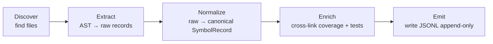

# Building a Total.Recall Scanner

A scanner is a small process that reads a target repo and writes JSONL
files under `data/<namespace>/`. The MCP server (which always runs as
the .NET process) reads those files and serves the 37 tools.

You can write a scanner in any language. The contract is in
[`SCANNER_SCHEMA.md`](SCANNER_SCHEMA.md). This doc tells you how to
*build* one — what to copy from the .NET reference scanner, what
patterns to use, and how to prove it works.

## TL;DR

1. Read [`SCANNER_SCHEMA.md`](SCANNER_SCHEMA.md). It defines every record
   shape the server expects.
2. Pick three things to produce: `type-registry.jsonl`,
   `coverage-gaps.jsonl`, `test-inventory.jsonl`. (Mock recipes, class
   metrics, dependency graph are optional v2 work.)
3. Wire up a 5-stage pipeline: **Discover → Extract → Normalize →
   Enrich → Emit**.
4. Ship a CLI that mirrors the .NET scanner's flag surface so users
   only learn one tool.
5. Pass the conformance fixture in [`tests/conformance/`](../tests/conformance/).
6. Publish to your language's package manager (PyPI, npm, crates.io …).

## Pattern stack

Every scanner — regardless of language — follows the same internal shape.
This is on purpose: anyone who's read one can read the others.

| Pattern | Job | .NET location | What to mirror |
|---|---|---|---|
| **Pipeline** | Sequence the five stages, allow per-stage skip / error isolation | `src/Total.Recall/Program.cs` scan dispatch | A `Stage` interface with `run(ctx)` and a `Pipeline` that composes them |
| **Adapter** | Convert the host language's AST into canonical `SymbolRecord` | `Scanners/AssemblyScanner.cs` (reflection → `TypeRecord`) | One adapter per language: Python `ast.NodeVisitor`, TS `ts-morph` visitor |
| **Strategy** | Pluggable coverage backend (Cobertura, coverage.py JSON, Istanbul JSON, lcov) | `Scanners/CoberturaParser.cs` (only impl today) | Registry keyed by `--coverage-format`; each strategy parses one format and emits canonical `CoverageGap` records |
| **Strategy** | Pluggable test-framework detector (pytest / jest / vitest / etc.) | `Scanners/TestProjectScanner.cs` (regex on `[Fact]`) | Registry keyed by `--test-framework`; auto-detect from config files when not specified |
| **Repository** | Append-only JSONL store with file-change detection | [`Infrastructure/JsonLineStore.cs`](../src/Total.Recall/Infrastructure/JsonLineStore.cs) | Mirror the contract: `read_all`, `write_all`, `append`, mtime-based cache busting |
| **Observer / Watcher** | Debounced file-watch → re-run pipeline | [`Scanners/ScannerWatcher.cs`](../src/Total.Recall/Scanners/ScannerWatcher.cs) | Use `watchdog` (Python), `chokidar` (TS), `notify` (Rust). 1.5s debounce. |
| **Builder** | Incrementally construct a `SymbolRecord` while visiting nodes | C# object initializers | Language-idiomatic equivalent — Python dataclass replace, TS fluent builder |
| **Registry** | Lookup strategies and language adapters by name | static dispatch in `Program.cs` | Single `dict`/`Map` keyed by string |

## The five pipeline stages



1. **Discover.** Walk the source tree (respecting `.gitignore` or an
   explicit `--source-root` flag) and find the files relevant to this
   stage's extractor. Return paths only — no parsing yet. Stable, sorted
   order so golden diffs work.
2. **Extract.** Parse each file with the language's native AST tool
   (`MetadataLoadContext` for .NET, `ast` for Python, `ts-morph` for TS).
   Emit raw, language-specific records. This is the only stage that
   knows about the host language.
3. **Normalize.** Map raw → canonical `SymbolRecord`. Fill the `lang`
   discriminator with language-specific extension fields. This is the
   adapter layer.
4. **Enrich.** Cross-reference coverage gaps with type registry, test
   inventory with classes-under-test, etc. The .NET scanner's `--enrich`
   flag drives this. Skip if the user didn't ask for it.
5. **Emit.** Write JSONL. **Rewrite** for derived stores (`type-registry`,
   `coverage-gaps`, `test-inventory`, `mock-recipes`). **Never touch**
   server-owned stores (`gotchas`, `assessments`, `sessions`, etc.).

## CLI flag surface (mirror the .NET scanner)

For UX consistency, new scanners should expose the same flags as the
.NET scanner where they make sense:

| .NET flag | Python / TS equivalent |
|---|---|
| `--assembly <dll>` | Python: `--package <path>` (or `--source-root`); TS: `--tsconfig <path>` |
| `--coverage <file>` | Same — Cobertura XML by default |
| `--coverage-format <name>` | `cobertura \| coveragepy-json \| istanbul-json \| lcov` |
| `--tests <dir>` | Same |
| `--source-root <dir>` | Same — persisted to `config.json` |
| `--namespace <name>` | Same |
| `--output <dir>` | Same — overrides namespace path entirely |
| `--enrich` | Same |
| `--analyze` | Same (optional, v2 work) |
| `--watch` | Same |
| `--test-framework <name>` | Per-language defaults: `pytest`, `jest` |
| `--mock-library <name>` | Per-language defaults: `unittest.mock`, `jest-mock` |

The scanner reads `TOTAL_RECALL_DATA`, `TOTAL_RECALL_NAMESPACE`,
`TOTAL_RECALL_SOURCE_ROOT` env vars with the same precedence as the .NET
scanner (CLI flag > config.json > env > default).

## Conformance suite (the lever)

Three scanners diverge without a forcing function. The forcing function is:

```
tests/conformance/
  fixtures/
    dotnet-sample/      ← tiny csproj
    python-sample/      ← tiny package with dataclass, ABC, classmethod, async def
    typescript-sample/  ← tiny tsconfig with class, interface, generic, ambient
  golden/
    dotnet-sample.type-registry.jsonl
    python-sample.type-registry.jsonl
    typescript-sample.type-registry.jsonl
    *.coverage-gaps.jsonl
    *.test-inventory.jsonl
  conformance_runner.py   ← language-agnostic diff harness
```

The harness:

1. Reads `fixtures/<sample>/`.
2. Runs the scanner under test against it.
3. Sorts the output JSONL by `name` (or `className` / `testFilePath`).
4. Strips volatile fields (timestamps, machine paths).
5. Diffs against `golden/<sample>.<store>.jsonl`.

A scanner is **conformant** iff it passes the harness against its
language's fixture. CI in every scanner repo runs the same harness.
When the schema changes, all golden files update in the same PR — that
is what catches silent drift.

## Process model

The scanner is a **sibling** of the MCP server, not a child. Each scanner
ships on its native package manager:

| Language | Package | Entry point |
|---|---|---|
| .NET | `TotalRecall.Mcp` (NuGet tool) | `total-recall scan` |
| Python | `total-recall-scan` (PyPI) | `total-recall-py scan` |
| TypeScript | `@total-recall/scan` (npm) | `npx @total-recall/scan` |

The MCP server stays .NET-only. It reads JSONL produced by any scanner.
Users can run multiple scanners (e.g. a polyglot repo with C# back-end
and TS front-end) under different namespaces, and the agent queries them
the same way.

## Writing the adapter — language notes

### Python

- **AST source:** Python's stdlib `ast` module. Parse with
  `ast.parse(source, type_comments=True)` so PEP 484 type comments are
  retained. For type information that survives runtime erasure, consider
  `mypy.fastparse` or `libcst` — but stdlib `ast` is sufficient for v1.
- **`kind` mapping:**
  - `ClassDef` → `class`. If `abc.ABC` in bases or `@abstractmethod` on
    methods → `isAbstract: true`.
  - `ClassDef` with `typing.Protocol` in bases → `kind: "protocol"`,
    `isInterface: true`.
  - Module-level `FunctionDef` / `AsyncFunctionDef` → `kind: "function"`.
  - `Enum` / `IntEnum` subclass → `kind: "enum"`, populate `enumValues`.
- **Constructors:** the `__init__` method's parameters (skip `self`),
  rendered with annotations.
- **Properties:** instance attrs declared in `__init__` (`self.x = ...`)
  PLUS class-level annotated attrs (dataclass fields, type-annotated
  class vars). Mark `hasInit: true` for frozen-dataclass fields.
- **`isInternal`:** name starts with single underscore (not dunder).
- **Mock recipes:** auto-emit for `Protocol` and `ABC` subclasses only.
  Generated snippet uses `unittest.mock.create_autospec` by default,
  or `pytest-mock`'s `mocker.create_autospec` when `--mock-library pytest-mock`.
- **Coverage:** primary input is Cobertura (`coverage.xml`, produced by
  `coverage xml`). Optional secondary: `coverage json --pretty` output.
- **Test inventory:** detect pytest (`def test_*`, files named `test_*.py`
  / `*_test.py`) and unittest (`class Test*(TestCase)` with `def test_*`
  methods). Capture line numbers.

### TypeScript

- **AST source:** `ts-morph` (preferred — high-level wrapper over the
  TypeScript Compiler API). Resolve via the project's `tsconfig.json`
  so generics, type aliases, and module paths are accurate.
- **`kind` mapping:**
  - `ClassDeclaration` → `class`. `abstract` modifier → `isAbstract: true`.
  - `InterfaceDeclaration` → `interface`, `isInterface: true`.
  - `TypeAliasDeclaration` → `type-alias`.
  - `EnumDeclaration` → `enum`, populate `enumValues`.
  - Top-level `FunctionDeclaration` / `const` arrow function with
    explicit type → `function`.
  - `declare` (ambient) declarations → `lang.isAmbient: true`, skipped
    from mock recipes.
- **Constructors:** `getConstructors()`; for interfaces with construct
  signatures, treat the construct signature's params.
- **Properties:** class fields + interface members. `readonly` modifier
  → `hasInit: true, hasSet: false`. Getters without setters → same.
- **`isInternal`:** symbol has no `export` modifier OR JSDoc tag
  `@internal`.
- **`namespace`:** the module path from the project root with the
  extension stripped and `/` separators (e.g. `src/foo/bar.ts` →
  `src/foo/bar` for purposes of `fullUsing`). Use module specifiers in
  `fullUsing` (`import { Bar } from "src/foo/bar";`).
- **Mock recipes:** auto-emit for interfaces and abstract classes.
  Default library `jest-mock` (`jest.mocked(...)` or
  `jest.fn<...>()` per method); `--mock-library vitest` for Vitest's
  `vi.fn()`.
- **Coverage:** primary input Cobertura (`coverage/cobertura-coverage.xml`
  emitted by `nyc --reporter cobertura` or `vitest --coverage`).
  Optional secondary: Istanbul `coverage/coverage-final.json`.
- **Test inventory:** detect Jest / Vitest (`describe(...)`, `it(...)`,
  `test(...)` — same surface for both, dispatch on
  `package.json` deps).

## What you do **not** need to do

- ❌ Reimplement the MCP server. It already speaks the protocol and
  serves 37 tools — yours just feeds it data.
- ❌ Implement static analysis (`--analyze`). Optional. Land symbols,
  coverage, tests first. The static-analysis tools degrade gracefully
  when those files are absent.
- ❌ Generate `gotchas`, `assessments`, `sessions`, `tool-calls`,
  `tasks`, `cycles`, `evals`, `challenges`. The server owns those.
- ❌ Match the .NET scanner's exact stdout/stderr format. Match the
  *behaviour* — JSONL output, exit codes, debounced watch — but emit
  whatever progress lines make sense for your ecosystem.

## Reference implementation

The .NET scanner is the reference. Read it in this order:

1. `src/Total.Recall/Program.cs` (`HandleScan`) — pipeline orchestration.
2. `src/Total.Recall/Scanners/AssemblyScanner.cs` — extract + normalize.
3. `src/Total.Recall/Scanners/CoberturaParser.cs` — Strategy example.
4. `src/Total.Recall/Scanners/TestProjectScanner.cs` — regex-based extractor.
5. `src/Total.Recall/Scanners/ScannerWatcher.cs` — debounced file-watch.
6. `src/Total.Recall/Infrastructure/JsonLineStore.cs` — the store
   contract every scanner mirrors.

Read [`AGENTS.md`](../AGENTS.md) for the working rules (test discipline,
code reuse, file size cap) — they apply to scanner contributions too.
